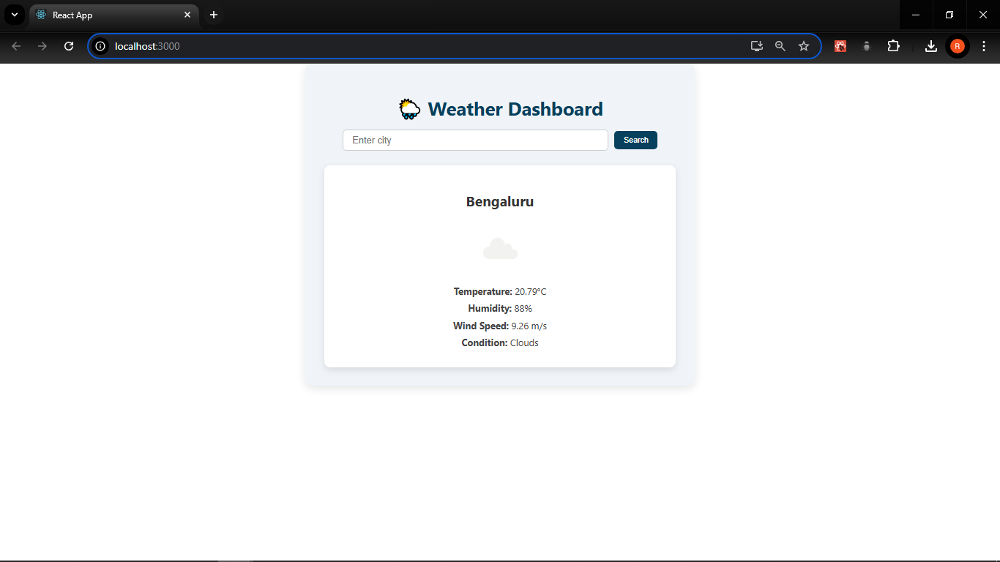
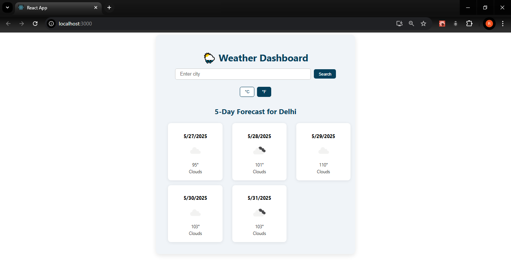
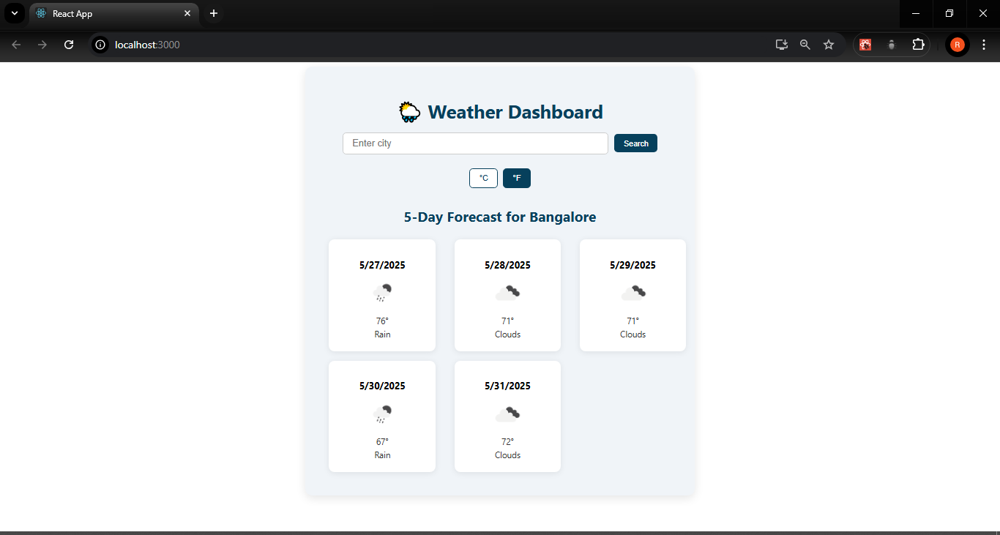

# Weather Dashboard 🌦️

A weather dashboard built with React, featuring real-time API polling, error handling, and clean UI.

## 🚀 Features
- Search by city
- Realtime weather data from OpenWeatherMap API
- Auto-refresh every 30 seconds
- Local storage for last searched city
- React Context API for state management
- Responsive UI using CSS Modules
- Can toggle for Units

## 📦 Tech Stack
React 18, Context API, CSS Modules

## 🛠️ Setup
1. Clone the repo
2. Install dependencies: `npm install`
3. Add your OpenWeatherMap API key in `services/weatherAPI.js`
4. Run the project: `npm start`

# Here is a glimplse of the app

